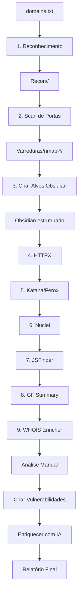

# 🔥 OPenPipeS - Obsidian Pentest Pipeline Stack

<div align="center">

```
   ___  ____            ____  _            ____  
  / _ \|  _ \ ___ _ __ |  _ \(_)_ __   ___/ ___| 
 | | | | |_) / _ \ '_ \| |_) | | '_ \ / _ \___ \ 
 | |_| |  __/  __/ | | |  __/| | |_) |  __/___) |
  \___/|_|   \___|_| |_|_|   |_| .__/ \___|____/ 
                                |_|               
```

**Pipeline Automatizado de Reconhecimento e Pentesting**

*Integrado com Obsidian MD para Documentação Inteligente*

[](https://github.com)
[](LICENSE)
[](https://kali.org)

</div>

---

## 📋 Índice

- [Sobre](#-sobre)
- [Características](#-características)
- [Arquitetura](#-arquitetura)
- [Instalação](#-instalação)
- [Configuração](#️-configuração)
- [Uso](#-uso)
- [Módulos](#-módulos)
- [Workflow](#-workflow-recomendado)
- [Troubleshooting](#-troubleshooting)
- [Contribuindo](#-contribuindo)

---

## 🎯 Sobre

**OPenPipeS** (Obsidian Pentest Pipeline Stack) é uma solução completa de automação para reconhecimento e pentesting de aplicações web, com integração nativa ao Obsidian MD para documentação estruturada e inteligente dos resultados.

### Problema que resolve:

Durante um pentest, coletamos **toneladas de dados** de diversas ferramentas (nmap, httpx, nuclei, etc.). Organizar, correlacionar e documentar essas informações de forma eficiente é um desafio.

O OPenPipeS automatiza todo o pipeline de recon e organiza os resultados em um Obsidian Vault estruturado, com:
- ✅ Dashboards interativos
- ✅ Tabelas dinâmicas com DataviewJS
- ✅ Navegação por links entre alvos
- ✅ Templates de vulnerabilidades prontos
- ✅ Enriquecimento automático com IA

---

## ✨ Características

- 🔍 **Reconhecimento Completo**: DNS, subdomínios, WHOIS, RDAP
- 🎯 **Scanning Automatizado**: Nmap com perfis otimizados
- 🌐 **Descoberta de Endpoints**: HTTPx, Katana, Feroxbuster
- 🧪 **Vulnerability Assessment**: Nuclei com templates atualizados
- 📜 **JavaScript Analysis**: LinkFinder para endpoints ocultos
- 🧬 **Pattern Matching**: GF (GrepFuzzable) para organização
- 📊 **Obsidian Integration**: Documentação estruturada e dinâmica
- 🤖 **AI-Powered**: Enriquecimento de vulnerabilidades com OpenAI
- 🎨 **Customizável**: Templates Markdown editáveis
- 🔄 **Pipeline Orquestrado**: Execute tudo com um comando

---

## 🏗 Arquitetura

```
OPenPipeS/
│
├── .openpipes/
│   ├── bin/                    # Scripts executáveis (no PATH)
│   ├── scripts/                # Scripts fonte
│   ├── .templates/             # Templates Obsidian/Markdown
│   └── config.sh               # Configuração global
│
├── .openpipes_cache/           # Cache de vulnerabilidades (JSON)
│
└── ~/.obsidianFixedMount/      # Vault do Obsidian
    └── Pentest/
        ├── Alvos/
        │   └── example.com/
        │       ├── example.com.md
        │       ├── Dashboard_example.com.md
        │       ├── Vulnerabilidades/
        │       ├── nmap.md
        │       ├── httpx.md
        │       ├── nuclei.md
        │       └── endpoints.md
        │
        ├── Dashboard_Global.md
        └── Tarefas.md
```

---

## 🚀 Instalação

### Pré-requisitos

- **OS**: Kali Linux / Debian / Ubuntu
- **Privilégios**: sudo (para instalar pacotes)
- **Espaço**: ~5GB (ferramentas + wordlists)

### Instalação Rápida

```bash
# 1. Clone o repositório
git clone https://github.com/seu-usuario/OPenPipeS.git
cd OPenPipeS

# 2. Execute o instalador
chmod +x install.sh
./install.sh

# 3. Recarregue o shell
source ~/.bashrc

# 4. Configure o projeto
nano ~/.openpipes/config.sh

# 5. Execute!
openpipes
```

### O que o instalador faz:

1. ✅ Instala dependências APT (nmap, jq, curl, etc.)
2. ✅ Instala ferramentas Go (httpx, nuclei, katana, gf)
3. ✅ Instala ferramentas Rust (feroxbuster)
4. ✅ Instala ferramentas Python (LinkFinder, dnsrecon)
5. ✅ Clona SecLists e prepara wordlists
6. ✅ Copia scripts para `~/.openpipes/`
7. ✅ Adiciona `~/.openpipes/bin` ao PATH
8. ✅ Cria estrutura inicial do Obsidian
9. ✅ Copia cache de vulnerabilidades (145 templates!)

---

## ⚙️ Configuração

Edite `~/.openpipes/config.sh`:

```bash
# Diretório onde ficam seus projetos de pentest
proj_dir="/home/kali/pentests"

# Nome do projeto atual
proj_name="cliente-xyz"

# Diretório do Obsidian (geralmente fixo)
obsdir="$HOME/.obsidianFixedMount/"

# API Keys (opcional mas recomendado)
securitytrailskey="sua-chave-aqui"
OPENAI_API_KEY="sk-..."
```

### Estrutura de Diretórios do Projeto

O OPenPipeS espera a seguinte estrutura:

```
/home/kali/pentests/cliente-xyz/
├── domains.txt              # Lista de domínios (um por linha)
├── Recon/                   # Resultados do reconhecimento
└── Varreduras/              # Resultados do scanning
    ├── targets.txt          # Gerado automaticamente
    └── nmap-*/              # Diretórios por alvo
```

---

## 🎮 Uso

### Comando Principal

```bash
openpipes
```

Isso abre o menu interativo:

```
╔════════════════════════════════════════════════════════════╗
║              MENU PRINCIPAL - OPenPipeS                    ║
╚════════════════════════════════════════════════════════════╝

[1] 🔍 Reconhecimento Completo
[2] 🎯 Scan de Portas/Serviços
[3] 📦 Criar Estrutura no Obsidian
[4] 🌐 HTTPX Runner
[5] 🔗 Katana + Feroxbuster
[6] 🧪 Nuclei Scanner
[7] 📜 JSFinder
[8] 🧬 GF Summary
[9] 🏷️  WHOIS Enricher

[V] 💥 Gerenciar Vulnerabilidades
[P] 🔄 Pipeline Completo (Todos os módulos)

[C] ⚙️  Configuração
[S] 📊 Status do Sistema
[H] 📖 Help/Documentação

[0] 🚪 Sair
```

### Uso Direto dos Scripts

Você também pode chamar os scripts diretamente:

```bash
# Reconhecimento
recon.sh -d domains.txt

# Scan de portas
nwrapper.sh -t 192.168.1.1,scanme.nmap.org

# HTTPx
httpx-runner.sh

# Pipeline completo
openpipes  # e escolha opção [P]
```

---

## 📦 Módulos

### 1️⃣ Reconhecimento (`recon.sh`)

**O que faz:**
- DNS enumeration (A, TXT, CNAME, DMARC)
- Subdomain discovery (dnsrecon, amass, SecurityTrails)
- RDAP/WHOIS lookup
- HTTPx probe inicial

**Saída:**
- `Recon/<dominio>/allsubs` - Lista de subdomínios
- `Recon/<dominio>/hosts-allsubs` - Resolução DNS
- `Recon/<dominio>/allsubs.httpx.json` - Probe HTTP
- `Varreduras/targets.txt` - Lista de IPs/hostnames para scan

### 2️⃣ Scan de Portas (`nwrapper.sh`)

**O que faz:**
- nmap SYN scan (-sS)
- Detecção de portas abertas
- Service/version detection (-sV)
- OS detection (-O)

**Saída:**
- `Varreduras/nmap-<host>/initial` - Scan inicial
- `Varreduras/nmap-<host>/nmap.nmap` - Scan detalhado
- `Varreduras/nmap-<host>/nmap.gnmap` - Formato grepable

### 3️⃣ Criação de Alvos (`cria_Alvos_Obsidian.sh`)

**O que faz:**
- Lê resultados do nmap
- Cria estrutura de pastas no Obsidian
- Gera dashboards personalizados por alvo
- Cria frontmatter YAML com metadados

**Saída:**
- `Obsidian/Pentest/Alvos/<host>/<host>.md`
- `Obsidian/Pentest/Alvos/<host>/Dashboard_<host>.md`
- `Obsidian/Pentest/Alvos/<host>/Vulnerabilidades/`

### 4️⃣ HTTPX Runner (`httpx-runner.sh`)

**O que faz:**
- Probe HTTP/HTTPS em portas web
- Detecta tecnologias (-tech-detect)
- Captura títulos de páginas
- Deduplicação automática

**Saída:**
- `Obsidian/Pentest/Alvos/<host>/httpx.md` - Tabela markdown
- `Obsidian/Pentest/Alvos/<host>/endpoints.md` - Lista de URLs

### 5️⃣ Katana + Feroxbuster (`katana-buster.sh`)

**O que faz:**
- Katana: web crawler
- Feroxbuster: directory brute-force
- Combinação para máxima cobertura

**Flags:**
- `--dns-only` - Testa apenas DNS
- `--ip-only` - Testa apenas IPs

**Saída:**
- `Obsidian/Pentest/Alvos/<host>/ferox-katana.md`
- `Obsidian/Pentest/Alvos/<host>/endpoints.md` (atualizado)

### 6️⃣ Nuclei (`nuclei-runner.sh`)

**O que faz:**
- Executa templates do nuclei
- Filtra por severidade (low, medium, high, critical)
- Gera relatório estruturado

**Saída:**
- `nuclei-output/<host>-nuclei.json`
- `Obsidian/Pentest/Alvos/<host>/nuclei.md`

### 7️⃣ JSFinder (`jsfinder-runner.sh`)

**O que faz:**
- Identifica arquivos .js nos endpoints
- Baixa e analisa com LinkFinder
- Extrai endpoints ocultos

**Flags:**
- `--force` - Reanalisa arquivos já processados

**Saída:**
- `Obsidian/Pentest/Alvos/<host>/js-endpoints.md`

### 8️⃣ GF Summary (`gf-summary.sh`)

**O que faz:**
- Agrupa endpoints por padrões (XSS, SQLi, LFI, etc.)
- Identifica extensões sensíveis (.bak, .env, etc.)
- Facilita análise manual

**Saída:**
- `Obsidian/Pentest/Alvos/<host>/gf-summary.md`

### 9️⃣ WHOIS Enricher (`whois-enricher.sh`)

**O que faz:**
- Extrai informações de ownership
- Atualiza dashboards com tabelas WHOIS

**Saída:**
- Atualiza `Dashboard_<host>.md` com bloco WHOIS

### 🔟 Gerenciamento de Vulnerabilidades

**Criar Vulnerabilidade (`cria_Vulnerabilidades.sh`):**
- Seleção interativa de alvo
- Escolha de template do cache (145 tipos!)
- Preenchimento automático de metadados

**Enriquecer (`vuln-enricher.sh`):**
- Usa OpenAI GPT-4 para gerar descrições técnicas
- Adiciona CWE, WSTG, links OWASP
- Cache para evitar redundância

---

## 🔄 Workflow Recomendado



### Passo a Passo:

1. **Prepare o ambiente:**
   ```bash
   cd /home/kali/pentests/cliente-xyz
   echo "exemplo.com" > domains.txt
   ```

2. **Execute o reconhecimento:**
   ```bash
   openpipes  # [1] Reconhecimento
   ```

3. **Faça o scan:**
   ```bash
   openpipes  # [2] Scan de Portas
   ```

4. **Crie a estrutura:**
   ```bash
   openpipes  # [3] Criar Alvos Obsidian
   ```

5. **Execute os módulos web:**
   ```bash
   openpipes  # [4] HTTPX
   openpipes  # [5] Katana/Ferox
   openpipes  # [6] Nuclei
   ```

6. **Análise de JavaScript:**
   ```bash
   openpipes  # [7] JSFinder
   openpipes  # [8] GF Summary
   ```

7. **Enriqueça metadados:**
   ```bash
   openpipes  # [9] WHOIS Enricher
   ```

8. **Abra o Obsidian:**
   - Abra a vault em `~/.obsidianFixedMount/`
   - Navegue pelos dashboards
   - Adicione notas e tarefas

9. **Documente vulnerabilidades:**
   ```bash
   openpipes  # [V] Gerenciar Vulnerabilidades
   ```

---

## 🛠 Troubleshooting

### Problema: "Script não encontrado"

**Solução:**
```bash
source ~/.bashrc
echo $PATH | grep openpipes
```

### Problema: "Configuração incompleta"

**Solução:**
```bash
nano ~/.openpipes/config.sh
# Preencha proj_dir e proj_name
```

### Problema: Ferramenta não instalada

**Solução:**
```bash
openpipes  # [S] Status do Sistema
# Veja o que está faltando e instale manualmente
```

### Problema: Obsidian não abre os arquivos

**Solução:**
- Certifique-se de que o Obsidian está apontando para `~/.obsidianFixedMount/`
- Verifique permissões: `chmod -R 755 ~/.obsidianFixedMount/`

### Problema: OpenAI API não funciona

**Solução:**
```bash
# Verifique sua chave
grep OPENAI ~/.openpipes/config.sh

# Teste manualmente
curl https://api.openai.com/v1/models \
  -H "Authorization: Bearer sk-..."
```

---

## 🤝 Contribuindo

Contribuições são bem-vindas! Siga estes passos:

1. Fork o projeto
2. Crie uma branch (`git checkout -b feature/AmazingFeature`)
3. Commit suas mudanças (`git commit -m 'Add AmazingFeature'`)
4. Push para a branch (`git push origin feature/AmazingFeature`)
5. Abra um Pull Request

---

## 📜 Licença

Distribuído sob a licença MIT. Veja `LICENSE` para mais informações.

---

## 🙏 Agradecimentos

- [ProjectDiscovery](https://projectdiscovery.io/) - httpx, nuclei, katana
- [OWASP](https://owasp.org/) - amass, testing guides
- [Obsidian](https://obsidian.md/) - melhor app de notas ever!
- [Kali Linux](https://kali.org/) - ambiente de pentesting

---

## 📞 Contato

**Rafael Luís da Silva**

📧 Email: seu-email@exemplo.com  
🐦 Twitter: [@seu_usuario](https://twitter.com/seu_usuario)  
💼 LinkedIn: [seu-perfil](https://linkedin.com/in/seu-perfil)

---

<div align="center">

**⭐ Se este projeto te ajudou, deixe uma estrela! ⭐**

Made with ❤️ and ☕ by Rafael Luís da Silva

</div>